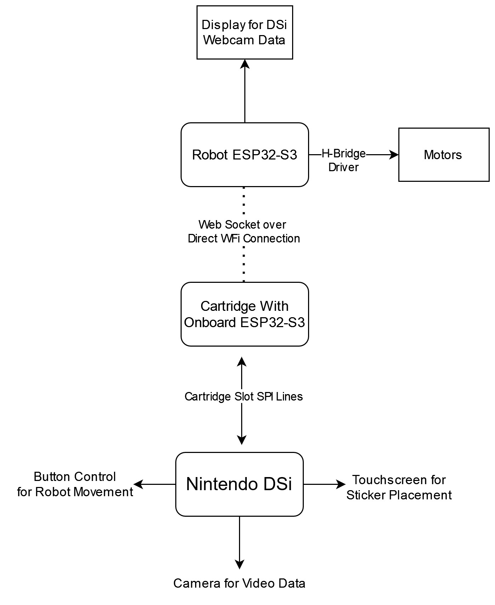
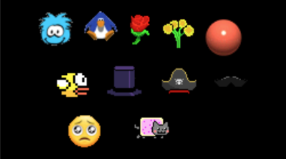
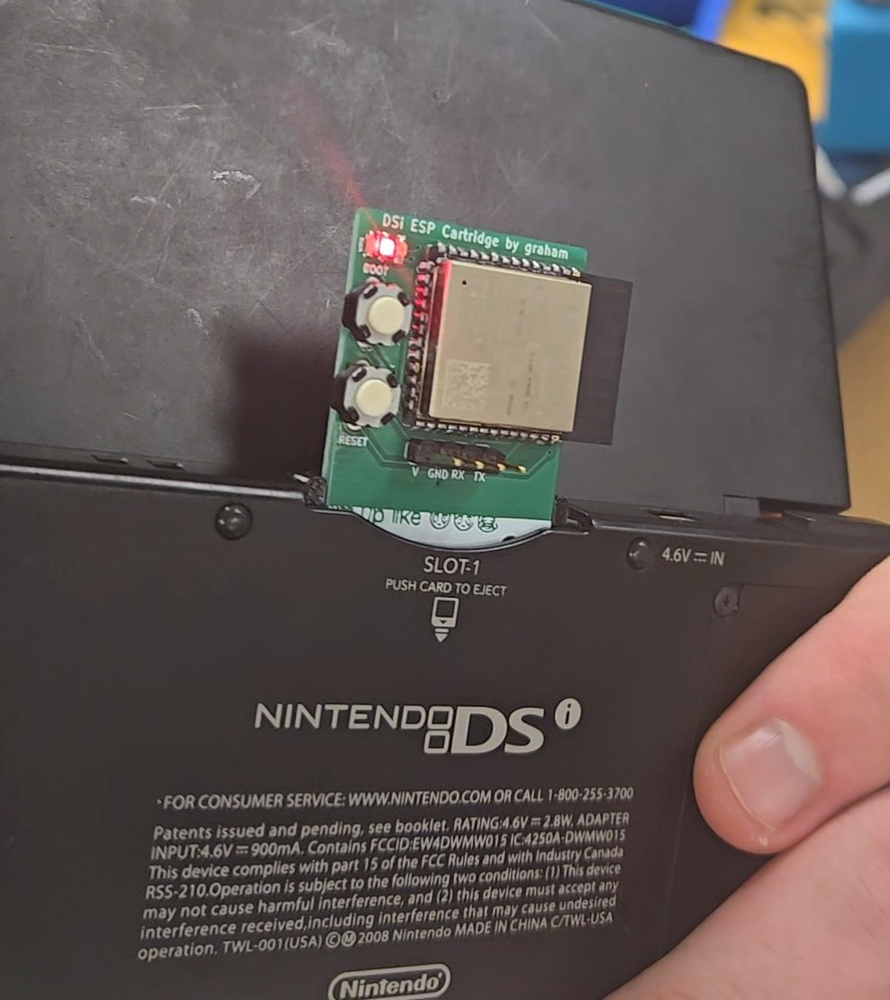
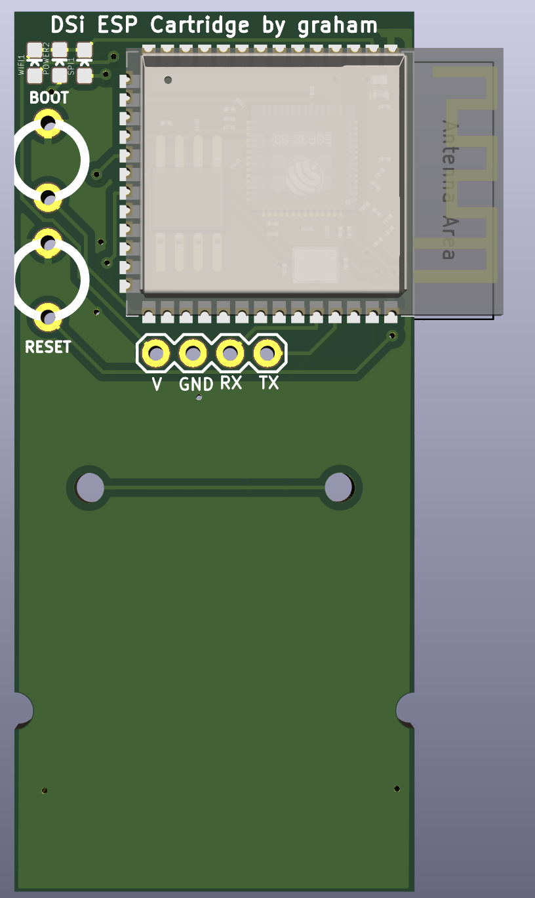
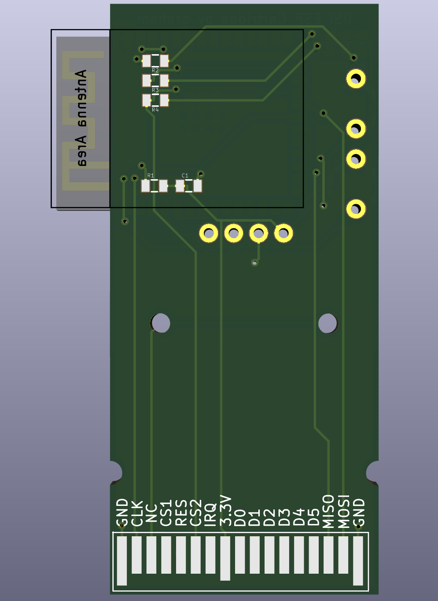
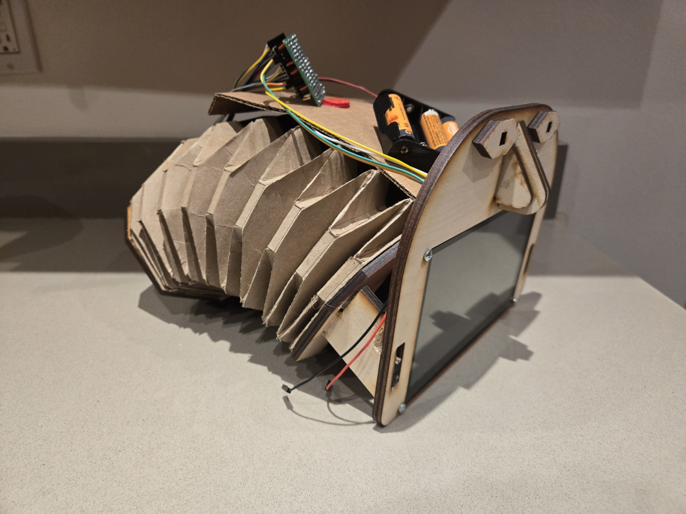
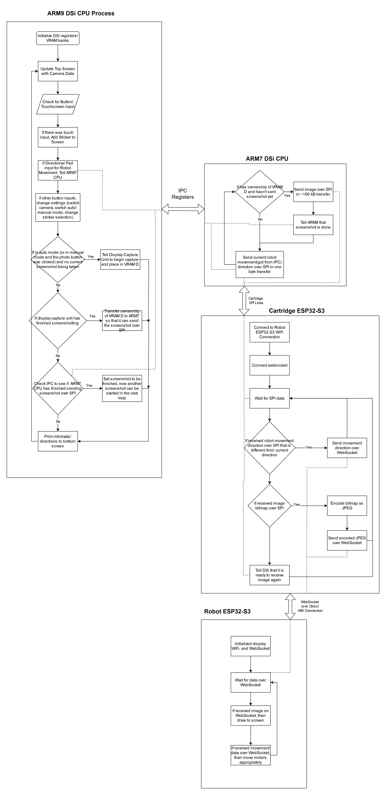

#### This project uses a Nintendo DSi to control a worm-like origami robot. The  DSi also streams live video data from its webcam to a TFT Display on the robot. This project involved programming custom homebrew and designing a PCB cartridge for the DSi, wireless ESP to ESP communication, image encoding, and motor control. Both the robot and DSi operate completely wirelessly.
| *The robot and the DSi with its custom cartridge slotted in* |
|:--:|
|  |

| *Block Diagram overview of all the devices in the system* |
|:--:|
|  |

The first part of this project is the Nintendo DSi. The DSi is running handwritten homebrew code (can be found in the **ds-app** folder). This application display the current DSi webcam data on the top screen. The user is able to place stickers over the webcam footage using the touchscreen. They are also able to switch between the front and back camera of the DSi. The webcam data is sent automatically if the user is in video mode, or whenever the user hits the A button when they are in photo mode. 

| *DSi Application with all the Stickers Placed* |
|:--:|
|  |

This application takes advantage of the two CPU's on the DSi. The image data is sent out over the SPI lines in the cartridge slot. The ARM9 CPU takes care of the main application, while the ARM7 CPU sends the SPI data in the background. These CPU's communicate with each other using the IPC register.

| *Close up of custom DSi Cartridge PCB and screenshots of Gerber files.* |
|:--:|
|     |

The raw bitmap image data is received over SPI on the ESP32-S3 on our custom cartridge PCB. This ESP32 is setup as SPI peripheral. It encodes the image as a JPEG (to reduce its size) and then sends it out over a WiFi WebSocket. It also receives and sends out the movement cortol signals for the robot. The code for this section can be found in **esp32-sender** folder.

The 7" TFT DIS08070H TFT Display is also powered by an ESP32-S3. The display ESP32 receives the data from the cartridge ESP32 over the direct Wifi connection. When it receives image data, it immediately draws it to the display. When it receives movement control signals, its uses our H-Bridge to appropiately tell the motors how to move. The code for this section can be found in **esp32-receiver** folder.

| *Side View of Robot* |
|:--:|
|  |

 For the robot, the design was inspired by a metamaterial soft snake robot built by the University of Southern Denmark. This design uses a Yoshimura Crease Pattern. 

The files for the cartridge PCB can be found in the **cartridge_pcb** folder and the CAD files for the cartridge housing in the **cartridge_cad** folder. The laser cutting and CAD files for the worm robot can be found in the **robot** folder.

| *Flowchart of the software/algorithm design* |
|:--:|
|  |

