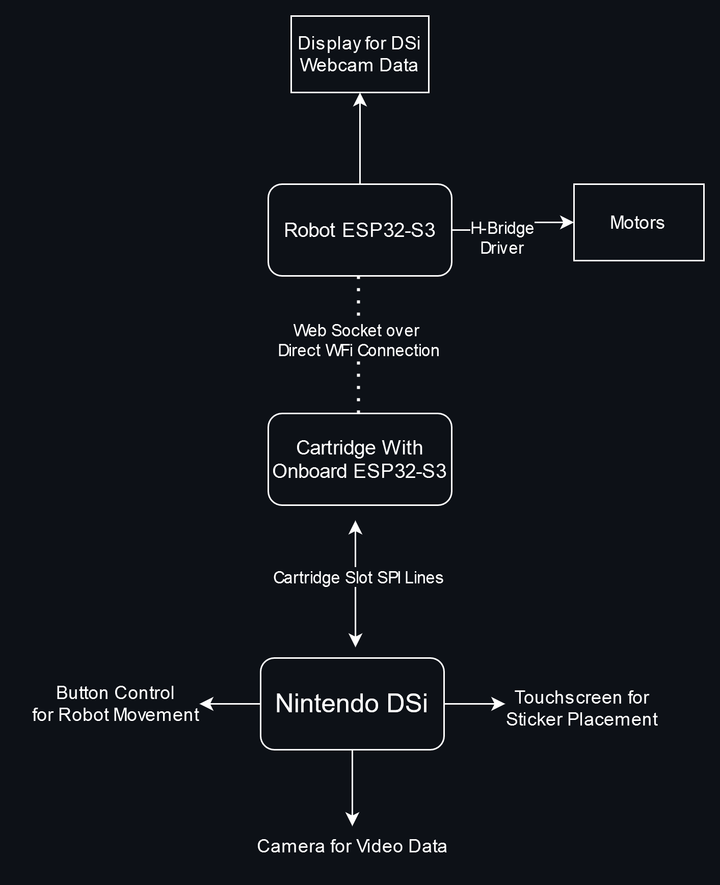

#### This project uses a Nintendo DSi to control a worm-like origami robot. The  DSi that also streams live video data from its webcam to a TFT Display  on the robot. This project involved programming custom homebrew and designing a PCB cartridge for the DSi, wireless ESP to ESP communication, image encoding, and motor and control.
|  |
|:--:|
| *In the photo above you can see the robot and the DSi with its custom cartridge slotted in.* |

|  |
|:--:|
| *Close up of custom DSi Cartridge PCB* |

|  |
|:--:|
| *The Block Diagram above shows the overview of all the devices in the system.* |